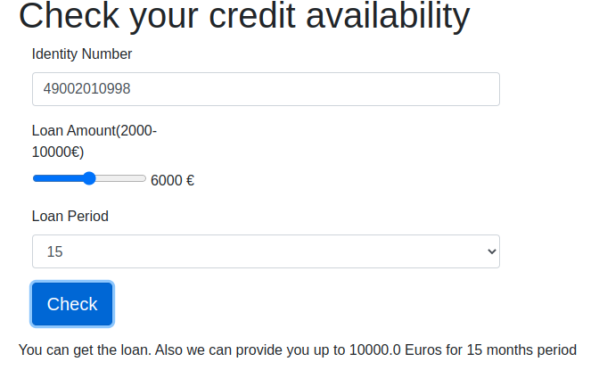
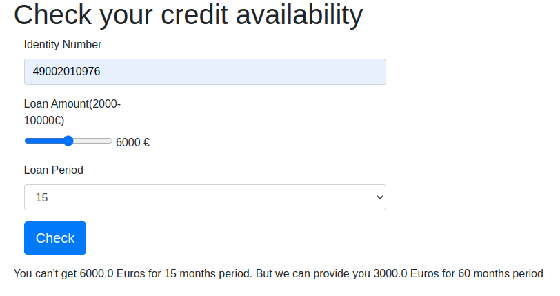
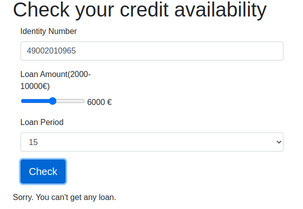

# Credit Decision Engine
This single page app can be used to decide if a person is eligible to get loan.

### Installing

To install project, download project as a zip and extract to under your project folder. 

After extracting folder run following command

```
./gradlew clean build
```

You also need to install redis server to be able to run the app. The redis server should run on 6379 port.

### Running

gradle bootrun is available for this project
```
gradlew bootRun
```

#### Runtime parameters
* Specifying credit rules can be managed from application.yaml

#### Result
When you run the application go to following link to see the page
```
http://localhost:8090/index
```

The project is using redis for caching person data from external service for one minute. This duration can be changed in yaml file.
This functionality brings a lot of performance enhancement to the app.


### Running app locally by docker

#### Step 1. Install docker
#### Step 2. Install redis
#### Step 3. Create docker image by following steps
1. ./gradlew clean build
2. docker build -t {app_image_name}:latest -f src/main/docker/Dockerfile .

#### Step 4. Run redis in docker by following steps
1. docker network create -d bridge {bridgeName}
2. docker run -d -p 6379:6379 --name {redis_name} --network {bridgeName} redis 
3. docker ps (to see what is up and running)
4. docker run --name {app_image_name} --link {bridge_name}:redis -d centos

If second 4.2 step gives error run (`docker system prune`). But be careful because this command will remove
  - all stopped containers
  - all networks not used by at least one container
  - all dangling images
  - all dangling build cache

### Some screenshots of the running app






